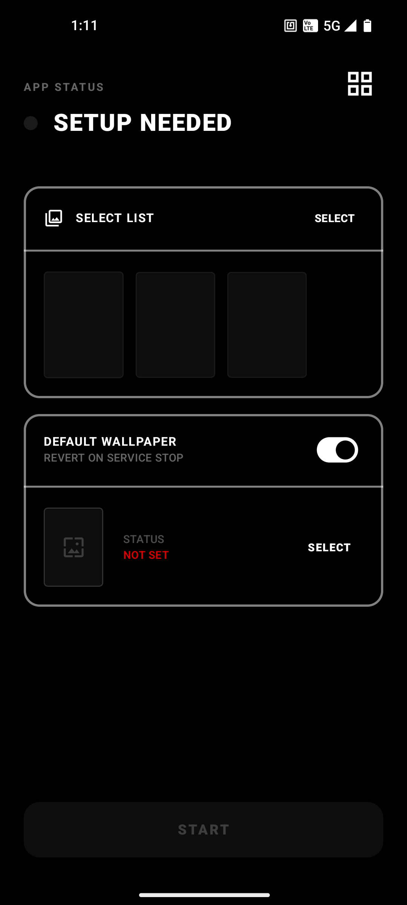
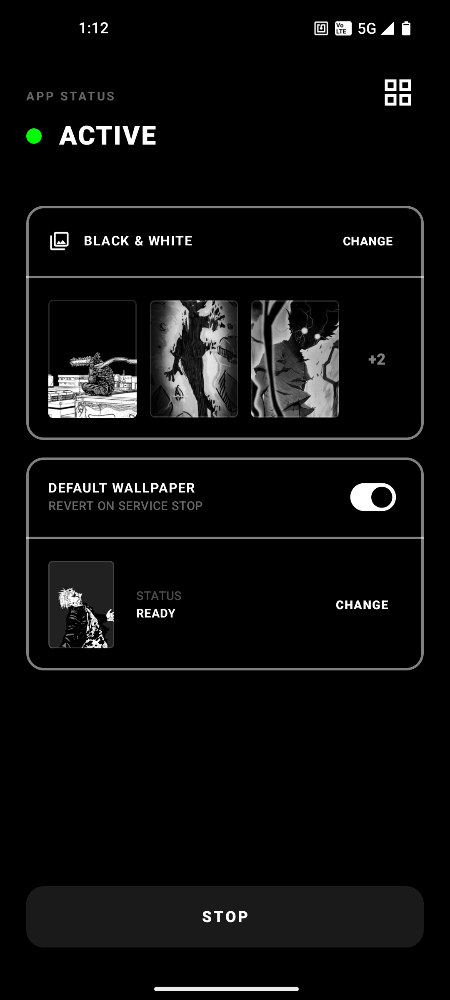
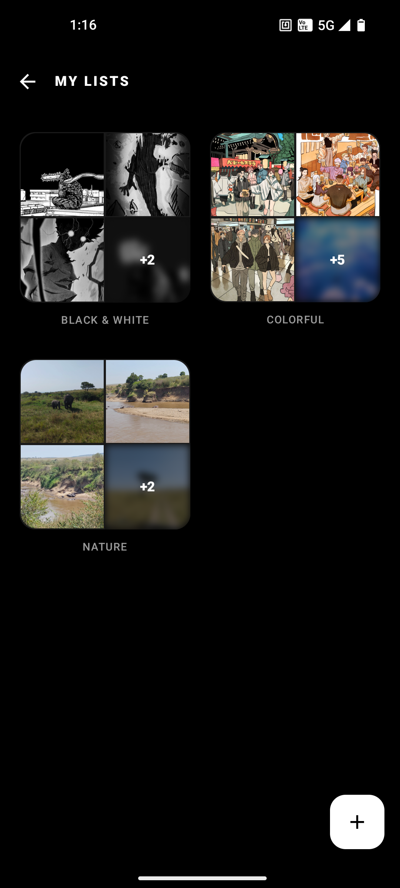
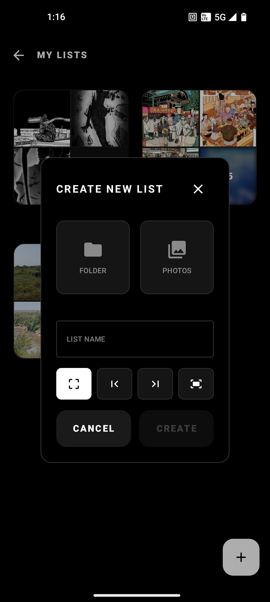
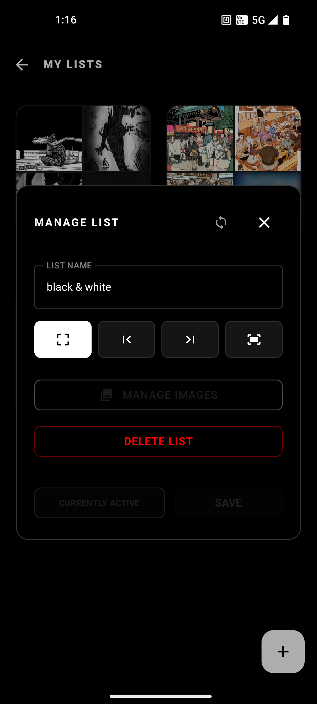

<div align="center">
  

  <h1>Wallpaper Changer for Nothing OS</h1>

  <p align="center">
    
    
    
    
  </p>

  <p>
    <b>A lightweight lock screen wallpaper changer.<br>Built by a Nothing user, for Nothing users.</b>
  </p>
  <p>
    <sub>Disclaimer: This is an independent, community-made tool. Not affiliated with or endorsed by Nothing Technology Limited.</sub>
  </p>
</div>

##  The "Why"

I love my Nothing Phone (1), but I missed a feature many other OS have: **changing the lock screen wallpaper every time I lock the phone.**

There weren't many solutions on the Play Store and the ones I found were either outdated, unreliable, or just didn't have the "changing on unlock" feature. As a Computer Science student, I decided to build my own solution that prioritizes **performance and user comfort/control**.

**While optimized for Nothing OS as it has been tested on my Nothing Phone (1), this app works on any device running Android 13+.**

---

##  Key Features

- **Instant Wallpaper Swap:** Each wallpaper is pre-processed and ready to go before you lock your phone resulting in no lag or  no loading screens. *(Achieved via a disk-buffered pipeline: downsample → crop → WebP.)*
- **Wallpaper Collections/Lists:** Organize wallpapers in two ways:
    - **Folder-based:** Point the app at a folder on your device and it picks up all the images inside, with re-sync on demand.
    - **Manual:** Hand-pick individual photos; they're safely copied into the app's private storage so they're always available.
- **Smart Shuffle:** Every image is shown exactly once before the collection reshuffles in order to never getting any individual wallpaper too often.
- **Flexible Cropping:** Choose how images fit your screen per collection: center, left-aligned, right-aligned, or fit-to-screen.
- **Rotation Timer Modes:** Configure each collection to rotate on every lock, every 1 hour, or once per day.
- **Quick Settings Tile:** Start, stop, or check status right from the notification shade letting you control it while doing something else.
- **Default Wallpaper Fallback:** Pick a fallback lock screen image that's automatically restored when the service stops or pauses.
- **Survives Reboots:** If the service was running before a restart, it picks right back up.
- **Battery Aware:** Automatically pauses during Battery Saver and resumes when it's turned off.
- **Self-Healing:** If an image can't be loaded (e.g., the file was deleted), the app skips it and moves on.
- **Privacy First:** No internet permissions. Your images never leave your device.

---

## Screenshots

<div align="center">
  <table>
    <tr>
      <td align="center"></td>
      <td align="center"></td>
      <td align="center"></td>
    </tr>
    <tr>
      <td align="center"><sub>Setup Needed</sub></td>
      <td align="center"><sub>Service Active</sub></td>
      <td align="center"><sub>Collections</sub></td>
    </tr>
    <tr>
      <td align="center"></td>
      <td align="center"></td>
      <td align="center"><video src="https://github.com/user-attachments/assets/6b4ad0d6-9da2-41fa-93fd-a61b268a31b7" width="300" controls></video></td>
    </tr>
    <tr>
      <td align="center"><sub>Create Collection</sub></td>
      <td align="center"><sub>Edit Collection</sub></td>
      <td align="center"><sub>Quick settings tile demo</sub></td>
    </tr>
  </table>
  <br/>
</div>

---

## FAQ

<details>
<summary><b>Will this drain my battery?</b></summary>

No. The app doesn't run on a timer or poll in the background, it simply waits for the screen to turn off, then swaps the wallpaper. The actual work (processing one image) takes a fraction of a second. It also automatically pauses during Battery Saver mode.
</details>

<details>
<summary><b>How much storage does it use?</b></summary>

- **Folder collections:** Almost none. The app just references the images where they already are on your device.
- **Manual collections:** Images are copied into the app's private storage as compressed WebP files at screen resolution. Expect roughly **0.2–1 MB per image**, so a 100-image collection might use around 20–100 MB.
- A single **buffer file** (~1 MB) is kept in cache for the next wallpaper. That's it.
</details>

<details>
<summary><b>Why is there a permanent notification?</b></summary>

Android requires any app doing background work to show a notification, it's a system rule, not a design choice. The notification is as minimal as possible and lets you see the service is running and which collection is active.
</details>

<details>
<summary><b>Why does it ask to disable battery optimization?</b></summary>

This is optional. Disabling battery optimization helps the app restart reliably after a reboot. Everything else works fine without it, but on some devices the auto-restart after reboot may be less reliable.
</details>

<details>
<summary><b>The app stopped working / doesn't restart after reboot</b></summary>

While in Nothing OS this shouldn't happen, other phone manufacturers (Xiaomi, Samsung, Huawei, etc.) aggressively kill background apps. Check [dontkillmyapp.com](https://dontkillmyapp.com) for device-specific instructions.
</details>

<details>
<summary><b>Does this change my home screen wallpaper too?</b></summary>

Currently, the app only changes the **lock screen** wallpaper. Home screen support may be added in a future update.
</details>

<details>
<summary><b>Does the app have access to all my photos?</b></summary>

No. When you select a folder, you're granting access to only that specific folder. For manual collections, only the photos you explicitly pick are copied. The app has **zero internet permissions**, so nothing ever leaves your device.
</details>

---

## Installation

### For Users
1.  Go to the [Releases Page](https://github.com/NineCSdev/nothing-wallpaper-changer/releases).
2.  Download the latest `.apk` file.
3.  Install on your Android device (you may need to allow "Install from Unknown Sources").
4.  **Grant Permissions:** Allow "Notifications" (required to keep the service alive in the background). The app may also ask to disable battery optimization — this improves reliability of the background service and boot-start.
5.  **Create a collection:** Open the app and create a collection either by selecting a folder or individual photos.

### Build from Source
```bash
git clone https://github.com/NineCSdev/nothing-wallpaper-changer.git
cd nothing-wallpaper-changer
# Open in Android Studio and sync Gradle
# Requires JDK 17, Android SDK 36
./gradlew assembleDebug        # macOS / Linux
gradlew.bat assembleDebug      # Windows
```

---

## Architecture

The app follows a clean layered architecture: **data** (Room + repository), **logic** (image pipeline), **model** (entities & enums), **service** (foreground service + receivers), and **ui** (single-activity Compose with MVVM).

> For the full project structure and design decisions, see [docs/ARCHITECTURE.md](/docs/ARCHITECTURE.md).

### How It Works

1. **User creates a collection** (folder or manual) → images are stored in Room.
2. **User presses Start** → `WallpaperService` starts as a foreground service, loads & shuffles the active collection into an in-memory magazine, and pre-processes the first wallpaper into a WebP disk buffer.
3. **Screen turns off** → `ScreenOffReceiver` fires, streams the buffer to `WallpaperManager.setStream()` on the lock screen flag, then triggers the repository to prepare the next image.
4. **Battery Saver ON** → The receiver is unregistered (paused); OFF → re-registered (resumed).
5. **User presses Stop** → Service stops; if "revert to default" is enabled, the saved default wallpaper is restored.
6. **Device reboots** → `BootReceiver` checks persisted state and restarts the service if it was previously active.

---

## Tech Stack

| Category      | Library / API                       |
|---------------|-------------------------------------|
| Language      | Kotlin 2.1 (JVM 17)                 |
| UI            | Jetpack Compose + Material 3        |
| Image loading | Coil 2.7                            |
| Database      | Room 2.7 (KSP)                      |
| Async         | Kotlin Coroutines + `SupervisorJob` |
| Lifecycle     | ViewModel + StateFlow / SharedFlow  |
| Min SDK       | 33 (Android 13)                     |
| Target SDK    | 36 (Android 16)                     |

---

## Permissions

| Permission                                              | Reason                                                     |
|---------------------------------------------------------|------------------------------------------------------------|
| `SET_WALLPAPER`                                         | Apply wallpapers to the lock screen                        |
| `FOREGROUND_SERVICE` / `FOREGROUND_SERVICE_SPECIAL_USE` | Keep the screen-off listener alive in the background       |
| `POST_NOTIFICATIONS`                                    | Show the required foreground service notification          |
| `RECEIVE_BOOT_COMPLETED`                                | Restart the service after a reboot                         |
| `REQUEST_IGNORE_BATTERY_OPTIMIZATIONS`                  | Improve reliability of boot-start and background operation |

No internet permission is requested — your images never leave your device.

---

## Development Approach

This is my first native Android project, built while actively learning about background services, wallpaper APIs, and system event architecture. I used AI tools as a learning accelerator for understanding unfamiliar Android internals and validating implementation approaches while iterating on the architecture and refining concurrency and system-level decisions.

---

## Status

**v0.2-alpha** — Core rotation engine, collection management, disk-buffered image pipeline, and Quick Settings tile are functional. The app is under active development.

---

## Author

NineCSdev (CS student @ UPM)

[GitHub](https://github.com/NineCSdev)
